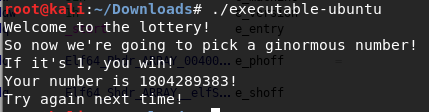
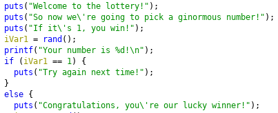

# executable-2

It's in here somewhere. Good luck... again.

(Now you actually have to try.)

File: executable-ubuntu

## Solution

  

To get the flag, our number needs to be 1. However, for some reason our number is always the same. What is going on ? 

 

Using ```Ghidra```, we are able to see that the executable calls ```rand()``` and compares the return value with ```1```. So how do we take advantage of this knowledge? After some searching, I came across this article https://rafalcieslak.wordpress.com/2013/04/02/dynamic-linker-tricks-using-ld_preload-to-cheat-inject-features-and-investigate-programs/. So basically, by compiling our own shared library and explicitly specifying it when runnning the executable, we are able to overwrite the behaviour of ```rand()```.

```c
// urandom.c
int rand(){
    return 1; //the most random number in the universe
}
```

We then compile it:
```bash
$ gcc -shared -fPIC unrandom.c -o unrandom.so
```

And lastly loading the shared library,
```bash
$ LD_PRELOAD=$PWD/unrandom.so ./executable-ubuntu > output.txt
```

In the contents of output.txt was:
```
Welcome to the lottery!
So now we're going to pick a ginormous number!
If it's 1, you win!
Your number is 1!
Congratulations, you're our lucky winner!
+
[
-
-
-
...
+
+
+
+
+
+
+
+
+
+
+
.
```

In the last portion there seems to be some special characters. If we append all of them together we get:
```
+[--------->++<]>.+.--.++.---------.++++++++++++.+++++.+[-->+<]>+++.--[----->+<]>-.-------------.+++++++++.++++++.+[->+++<]>.++++++.[--->+<]>+.-[->+++<]>.--.-[--->+<]>-.-.+[->+++<]>++.+.++++++++++.-------.[--->+<]>----.++[->+++<]>.+++++++.-[--->+<]>--.-------.[------>+<]>++.+[-->+++<]>-.[--->+++++<]>.[----->+++<]>.[--->+<]>-.------------.+.+++++.---.------------.[--->+<]>--.----.+[----->++<]>-.[--->+<]>--.+++[->+++<]>++.+++++++.-----.++++.--.+++++++++.--------.-[--->+<]>-.[->+++<]>.[--->+<]>--.---.+++++++.[->+++<]>--.++++++++.++++.++.[->+++<]>.+++++++++++++.+++[->+++<]>++.+++++++++.+[--->+<]>+.[->+++<]>.-----------.-[--->+<]>++.--[->+++<]>.[--->+<]>.[->+++<]>-.++++++++.-.+++++++++.--------.-[--->+<]>-.--.++[->+++<]>.[--->+<]>++.-------.+++++++++++.
```

This looks like some ```Brainfuck``` code. Lets use an online interpreter for this. We get:

```
rsqsjv{Arent_executables_fun?_I_think_so_sdkfjhqiweuryiquwerajzncxbvaihqiwueyr}
```

Hmm... there are some readable words but the flag format isn't correct. Maybe some cipher was applied to it ?

```
bcactf{Kboxd_ohomedklvoc_pex?_S_drsxu_cy_cnuptrasgoebisaegobktjxmhlfksrasgeoib}
```

I tried with different rotations and got the flag. The shift that was applied to get the flag was 10.

Flag: ```bcactf{Kboxd_ohomedklvoc_pex?_S_drsxu_cy_cnuptrasgoebisaegobktjxmhlfksrasgeoib}``` 