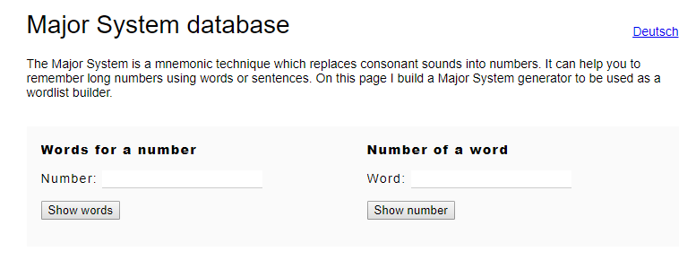

# a-major-problem

A mysterious figure named Major Mnemonic has sent you the following set of words. Figure out what they mean!

"Pave Pop Poke Pop Dutch Dozen Denim Deism Loot Thatch Pal Atheism Rough Ditch Tonal"

made by: @natjef

## Solution

I did not know anything about mnemonic so I just searched ```mnemonic decoder```.

  

I came across a website https://major-system.info/en/ and it is able to convert these words into numbers ? What I got was ```98 99 97 99 116 102 123 103 51 116 95 103 47 116 125```. They seem to look like the ASCII printable values.

What I got was ```bcactf{g3t_g/t}```. However, this was the correct flag so I had to get smart. The ```/``` character seems a little out of place but if we were to look at the ASCII table, the next character is a ```0```. Replacing the ```/``` with ```0```, we get the correct flag.


Flag: ```bcactf{g3t_g0t}``` 