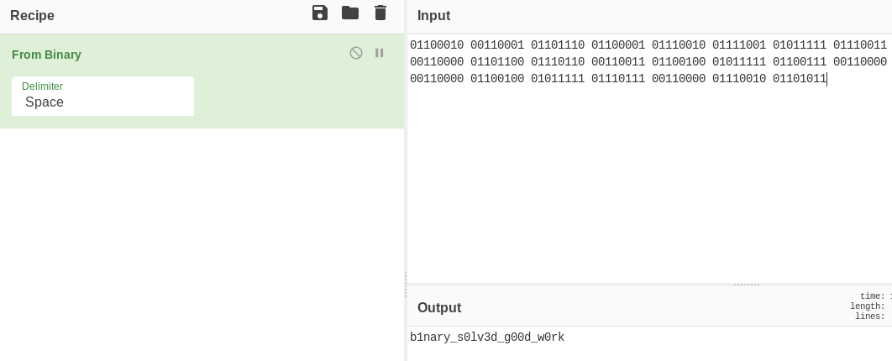

# basic-numbers

We have a raw flag here, but what do we do with it?

01100010 00110001 01101110 01100001 01110010 01111001 01011111 01110011   
00110000 01101100 01110110 00110011 01100100 01011111 01100111 00110000   
00110000 01100100 01011111 01110111 00110000 01110010 01101011   
made by: @camelliaguan

The answer should be in the format bcactf{answer}.

## Solution

Using Cyberchef's From Binary operation,



Flag: ```bcactf{b1nary_s0lv3d_g00d_w0rk}``` 