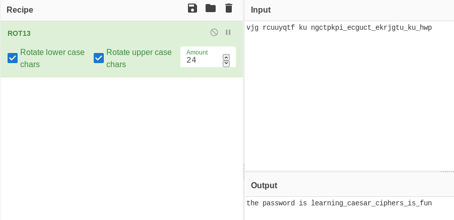

# cracking-the-cipher

Hackers work in the most unlikely of places. We have recently discovered one working in a grocery store (weird), and he was able to print out receipts to pass on information to certain customers. We have obtained one of the receipts, but we cannot tell what it says.  
```
Grocery Store Receipt  
Item 	                Unit Price  Quant. 	  Overall Price  
Caesar Salad Dressing   5.99 	    4 	          23.96  
Vinegar 	        6.99 	    1 	          6.99  
Apples (Honey Crisp) 	2.79 	    5 	          13.95  
Roast Chicken 	        7.59 	    1 	          7.59  
Tomatoes 	        1.59 	    4 	          6.36  
                                Subtotal 	  58.85  
                                Paper Bag Fee     0.10  
                                Taxes (9.00%)     0.00  
                                Total 	          58.95 
```
vjg rcuuyqtf ku ngctpkpi_ecguct_ekrjgtu_ku_hwp!

Can you crack the code and tell us the information within? The answer should be in the format `bcactf{answer}`.

made by: @camelliaguan

## Solution

Judging from the first item, this cipher used is probably the Caesar Cipher. Using Cyberchef's ROT13 operation and iterating through each possible rotation, we get the flag.



Flag: ```bcactf{learning_caesar_ciphers_is_fun}``` 