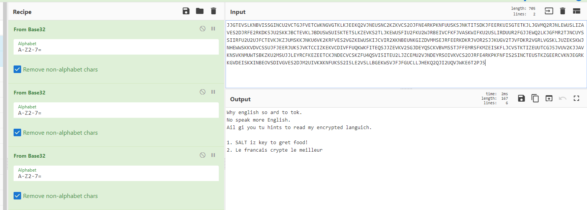

# three-step-program

We found this strange file with a bunch of stuff in it... Can you help us decode it?

made by: @mars7543

File: RmlsZW5hbWU.txt

## Solution

In the first line we get what seems to be a Base64 string. Decoding it, we get: 

  

32 ? Maybe it has something to do with Base32 ?

  

By decoding the second line in the file 3 times, we were able to get something sensible. The word ```SALT``` seem to be in uppercase for some reason and the last sentence is completely in french ? If we translate it to english, we get ```French crypt the best```. When we search for french encryption algorithms, we get:

  

Fortunately, Cyberchef actually comes a Vigenere Decode operation. If we use ```SALT``` as the key and decipher the last line in file,

  

Flag: ```bcactf{ju57_y0u_w4i7_znjhbmnhaxm}``` 