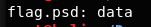
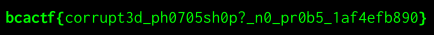

# corrupt-psd

I wanted to use Photoshop to embiggen my head, but er... something happened. It looks like Photoshop isn't the signature image editing program it used to be.

Can you help fix this?

File: flag.psd

## Solution

The hints "head" and "signature" are probably pointing towards "file headers". If we run ```file``` on it,



There seems to be problem with the file signature. Lets run ```hexeditor``` on it.


Comparing the given file with a legitimate .psd file, we see that ```38 42``` should be in first 2 bytes. If we fix it, ```file``` will then be able to recognize it as a .psd file. By running:

```
$ convert flag.psd flag.png
```



Flag: ```bcactf{corrupt3d_ph0705sh0p?_n0_pr0b5_1af4efb890}``` 