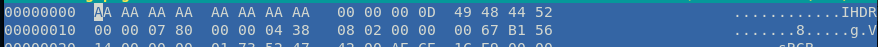
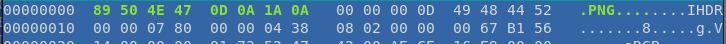

# file-head

It looks like the PNG file that holds our flag has been corrupted. My computer isn't able to recognize the file type, maybe it has something to do with how the file type is recognized...

made by: @20nlevin

File: flag.png

## Solution


When running ```file``` on it, we are told that it was not a .png file. Lets look using ```hexeditor```.



If we compare this with the a normal .png file,


We realise that the ```png``` file header is missing. To fix it, we replace the first 8 bytes with ```89 50 4E 47 0D 0A 1A 0A```.



Save the file and open it to get the flag.


Flag: ```bcactf{f1l3_h3ad3rs_r_c001}``` 