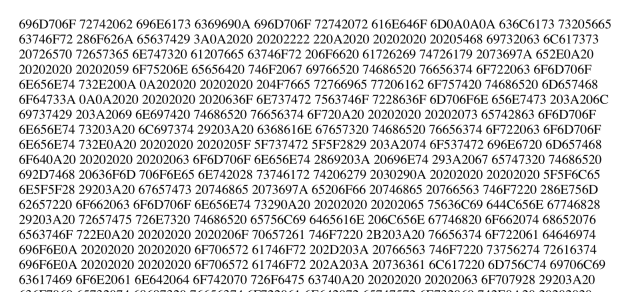
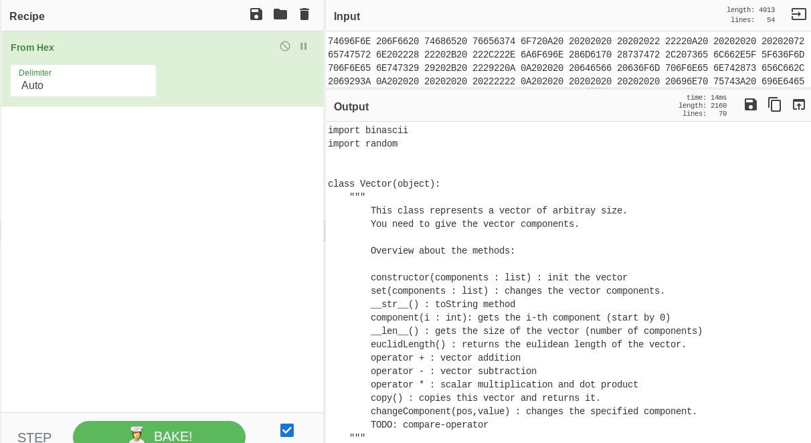

# of-course-rachel

Ugh, I had a really important file with the flag, but sadly it broke. My friend Rachel said that snapshots are good for backing up, and luckily I listened so here is my screenshot. Do you think you could help me put it back together?

problem by: @aidanglickman

File: snapshot.zip

## Solution



In ```snapshot.zip``` were 5 .png files, each with contents looking like this. However, it would be very troublesome to slowly convert these to text. Hence, I went to search for any Image to Text websites.


I came across ```https://www.onlineocr.net/```, which is able to accept images and documents and convert them into text using Optical Character Recognition. Seeing that the acronym is "OCR", I immediately knew that I was on the right track based on the challenge's name (If you looked at the first letter of each word, you will get "OCR")



Using Cyberchef and the "From Hex" operation, we observed that the pictures contained some python code. If we append all of them together,

```python
import binascii
import random


class Vector(object):
    """
        This class represents a vector of arbitray size.
        You need to give the vector components. 

        Overview about the methods:

        constructor(components : list) : init the vector
        set(components : list) : changes the vector components.
        __str__() : toString method
        component(i : int): gets the i-th component (start by 0)
        __len__() : gets the size of the vector (number of components)
        euclidLength() : returns the eulidean length of the vector.
        operator + : vector addition
        operator - : vector subtraction
        operator * : scalar multiplication and dot product
        copy() : copies this vector and returns it.
        changeComponent(pos,value) : changes the specified component.
        TODO: compare-operator
    """

    def __init__(self, components=[]):
        """
            input: components or nothing
            simple constructor for init the vector
        """
        self.__components = list(components)

    def set(self, components):
        """
            input: new components
            changes the components of the vector.
            replace the components with newer one.
        """
        if len(components) > 0:
            self.__components = list(components)
        else:
            raise Exception("please give any vector")

    def __str__(self):
        """
            returns a string representation of the vector
        """
        return "(" + ",".join(map(str, self.__components)) + ")"

    def component(self, i):
        """
            input: index (start at 0)
            output: the i-th component of the vector.
        """
        if type(i) is int and -len(self.__components) <= i < len(self.__components):
            return self.__components[i]
        else:
            raise Exception("index out of range")

    def __len__(self):
        """
            returns the size of the vector
        """
        return len(self.__components)

    def eulidLength(self):
        """
            returns the eulidean length of the vector
        """
        summe = 0
        for c in self.__components:
            summe += c**2
        return math.sqrt(summe)

    def __add__(self, other):
        """
            input: other vector
            assumes: other vector has the same size
            returns a new vector that represents the sum.
        """
        size = len(self)
        if size == len(other):
            result = [self.__components[i] +
                      other.component(i) for i in range(size)]
            return Vector(result)
        else:
            raise Exception("must have the same size")

    def __sub__(self, other):
        """
            input: other vector
            assumes: other vector has the same size
            returns a new vector that represents the differenz.
        """
        size = len(self)
        if size == len(other):
            result = [self.__components[i] -
                      other.component(i) for i in range(size)]
            return result
        else:  # error case
            raise Exception("must have the same size")

    def __mul__(self, other):
        """
            mul implements the scalar multiplication 
            and the dot-product
        """
        if isinstance(other, float) or isinstance(other, int):
            ans = [c*other for c in self.__components]
            return ans
        elif (isinstance(other, Vector) and (len(self) == len(other))):
            size = len(self)
            summe = 0
            for i in range(size):
                summe += self.__components[i] * other.component(i)
            return summe
        else:  # error case
            raise Exception("invalide operand!")

    def copy(self):
        """
            copies this vector and returns it.
        """
        return Vector(self.__components)

    def changeComponent(self, pos, value):
        """
            input: an index (pos) and a value
            changes the specified component (pos) with the
            'value'
        """
        # precondition
        assert (-len(self.__components) <= pos < len(self.__components))
        self.__components[pos] = value


flag = 820921601166721424573282546345206805820898697321521913920196691573868657577500743744203737234698


def zeroVector(dimension):
    """
        returns a zero-vector of size 'dimension'
    """
    # precondition
    assert(isinstance(dimension, int))
    return Vector([0]*dimension)


def main():
    print(int_to_text(flag))


def unitBasisVector(dimension, pos):
    """
        returns a unit basis vector with a One 
        at index 'pos' (indexing at 0)
    """
    # precondition
    assert(isinstance(dimension, int) and (isinstance(pos, int)))
    ans = [0]*dimension
    ans[pos] = 1
    return Vector(ans)


def axpy(scalar, x, y):
    """
        input: a 'scalar' and two vectors 'x' and 'y'
        output: a vector
        computes the axpy operation
    """
    # precondition
    assert(isinstance(x, Vector) and (isinstance(y, Vector))
           and (isinstance(scalar, int) or isinstance(scalar, float)))
    return (x*scalar + y)


def randomVector(N, a, b):
    """
        input: size (N) of the vector.
               random range (a,b)
        output: returns a random vector of size N, with 
                random integer components between 'a' and 'b'.
    """
    random.seed(None)
    ans = [random.randint(a, b) for i in range(N)]
    return Vector(ans)


def text_to_int(inp):
    hexed = binascii.hexlify(inp)
    return int(hexed, 16)


def int_to_text(inp):
    hexed = hex(inp)
    return bytearray.fromhex(hexed[2:]).decode()


class Matrix(object):
    """
    class: Matrix
    This class represents a arbitrary matrix.

    Overview about the methods:

           __str__() : returns a string representation 
           operator * : implements the matrix vector multiplication
                        implements the matrix-scalar multiplication.
           changeComponent(x,y,value) : changes the specified component.
           component(x,y) : returns the specified component.
           width() : returns the width of the matrix
           height() : returns the height of the matrix
           operator + : implements the matrix-addition.
           operator - _ implements the matrix-subtraction
    """

    def __init__(self, matrix, w, h):
        """
            simple constructor for initialzes 
            the matrix with components.
        """
        self.__matrix = matrix
        self.__width = w
        self.__height = h

    def __str__(self):
        """
            returns a string representation of this
            matrix.
        """
        ans = ""
        for i in range(self.__height):
            ans += "|"
            for j in range(self.__width):
                if j < self.__width - 1:
                    ans += str(self.__matrix[i][j]) + ","
                else:
                    ans += str(self.__matrix[i][j]) + "|\n"
        return ans

    def changeComponent(self, x, y, value):
        """
            changes the x-y component of this matrix
        """
        if x >= 0 and x < self.__height and y >= 0 and y < self.__width:
            self.__matrix[x][y] = value
        else:
            raise Exception("changeComponent: indices out of bounds")

    def component(self, x, y):
        """
            returns the specified (x,y) component
        """
        if x >= 0 and x < self.__height and y >= 0 and y < self.__width:
            return self.__matrix[x][y]
        else:
            raise Exception("changeComponent: indices out of bounds")

    def width(self):
        """
            getter for the width
        """
        return self.__width

    def height(self):
        """
            getter for the height
        """
        return self.__height

    def __mul__(self, other):
        """
            implements the matrix-vector multiplication.
            implements the matrix-scalar multiplication
        """
        if isinstance(other, Vector):  # vector-matrix
            if (len(other) == self.__width):
                ans = zeroVector(self.__height)
                for i in range(self.__height):
                    summe = 0
                    for j in range(self.__width):
                        summe += other.component(j) * self.__matrix[i][j]
                    ans.changeComponent(i, summe)
                    summe = 0
                return ans
            else:
                raise Exception(
                    "vector must have the same size as the " + "number of columns of the matrix!")
        elif isinstance(other, int) or isinstance(other, float):  # matrix-scalar
            matrix = [[self.__matrix[i][j] *
                       other for j in range(self.__width)] for i in range(self.__height)]
            return Matrix(matrix, self.__width, self.__height)

    def __add__(self, other):
        """
            implements the matrix-addition.
        """
        if (self.__width == other.width() and self.__height == other.height()):
            matrix = []
            for i in range(self.__height):
                row = []
                for j in range(self.__width):
                    row.append(self.__matrix[i][j] + other.component(i, j))
                matrix.append(row)
            return Matrix(matrix, self.__width, self.__height)
        else:
            raise Exception("matrix must have the same dimension!")

    def __sub__(self, other):
        """
            implements the matrix-subtraction.
        """
        if (self.__width == other.width() and self.__height == other.height()):
            matrix = []
            for i in range(self.__height):
                row = []
                for j in range(self.__width):
                    row.append(self.__matrix[i][j] - other.component(i, j))
                matrix.append(row)
            return Matrix(matrix, self.__width, self.__height)
        else:
            raise Exception("matrix must have the same dimension!")


def squareZeroMatrix(N):
    """
        returns a square zero-matrix of dimension NxN
    """
    ans = [[0]*N for i in range(N)]
    return Matrix(ans, N, N)


def randomMatrix(W, H, a, b):
    """
        returns a random matrix WxH with integer components
        between 'a' and 'b'
    """
    random.seed(None)
    matrix = [[random.randint(a, b) for j in range(W)] for i in range(H)]
    return Matrix(matrix, W, H)


main()
```

Running this prints out the flag. Note that this script needs to run using python3.

Flag: ```bcactf{0p71c4lly_r3c0gn1z3d_ch4r4c73rs}``` 