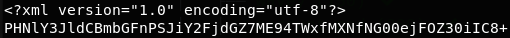
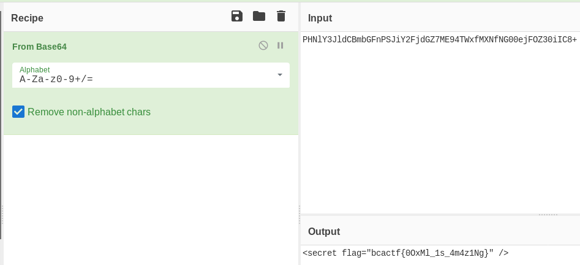

# open-docs

Yay! I really enjoy using these free and open file standards. I love them so much, that I made a file expressing how much I like using them. Let's enjoy open standards together!

made by: @edwfeng

File: open.docx

## Solution

Instead of opening the file, I ran ```unzip``` on it. Inside of ```word/``` was a file called ```secrets.xml```.



The string seems like a base64-encoded string. Using Cyberchef's From Base64 operation,



Flag: ```bcactf{0OxMl_1s_4m4z1Ng}``` 