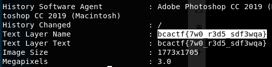

# split-the-red-sea

Moses used a staff to split the Red Sea. What will you use?

made by: @aidanglickman

File: redsea.png

## Solution

Nothing much to see in the picture, but if we use ```exiftool```,



Flag: ```bcactf{7w0_r3d5_sdf3wqa}``` 