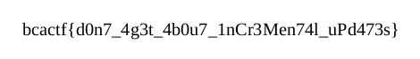

# the-flag-is

I have a flag! The flag is... wait... did my PDF editor not save the flag? OH NO! I remember typing it in, can you help me find it?

made by: @edwfeng

File: flag.pdf

## Solution

I was a little lucky with this challenge as what I did was simply running ```foremost``` on it.



The output was a .pdf, but instead of containing "The flag is ...", it contained the flag.

Flag: ```bcactf{d0n7_4g3t_4b0u7_1nCr3Men74l_uPd473s}``` 