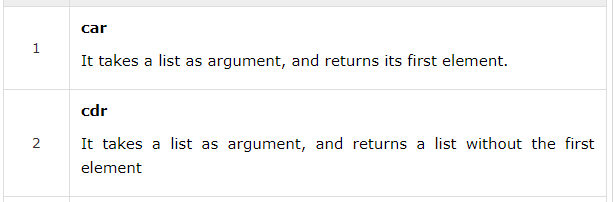

# manner-of-thpeaking

Tho, I came Acroth thith therieth of inthturcthins, and thomething that thaid "the key ith the attached litht of ATHCII printableth." Tho anywayth, here'th the inthtructhinth.

made by: @aidanglickman

File: printableth.txt, inthtructhins.txt

## Solution

The description did not really make any sense but the ```inthtructhins.txt``` did. If we looked a sample of it,

```
cadadddddr, caddadddddr, caadddddr, caddadddddr
```

We get words that start with ```c``` and ends with ```s``` and have varying number of ```a``` and ```d``` in between. When searching about this, I came across 2 functions in Lisp: ```car``` and ```cdr```.



I also read up that ```car``` and ```cdr``` can be combined in a way to chain their calls. For example,

```(cadr x)``` is equals to ```(car (cdr x))```    

I did not know how to code in Lisp, so I decided to implement both functions in python. I also had to modify the contents of 
```printableth.txt``` to suit python.

```python
printable = (" !\"#$%&'\(\)*+,-./","0123456789",":;<=>?@","ABCDEFGHIJKLMNOPQRSTUVWXYZ","[\\]^_`","abcdefghijklmnopqrstuvwxyz","{|}~")

def car(iterable):
    return iterable[0]

def cdr(iterable):
    return iterable[1:]

def eval(command):
    command = command[1:-1][::-1]
    curr = printable
    for c in command:
        if c == "d":
            curr = cdr(curr)
        else:
            curr = car(curr)
    return curr
	
output = ""
with open("inthtructhins.txt", "r") as f:
    instructions = f.read().split(", ")
    for instruction in instructions:
        output += eval(instruction)
print output
```

Flag: ```bcactf{L157_8453d_pR0gR4Mm1nG_15_4w3S0Me!}``` 