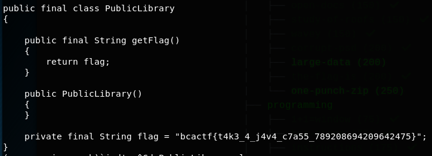

# public-library

Hidden in this mysterious public library is the flag. Can you get it?

File: PublicLibrary.jad

## Solution

This question was more of a forensics question than a programming question. Given a java class, if we decompile it with ```jad```,



Flag: ```bcactf{t4k3_4_j4v4_c7a55_789208694209642475}``` 