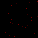
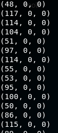
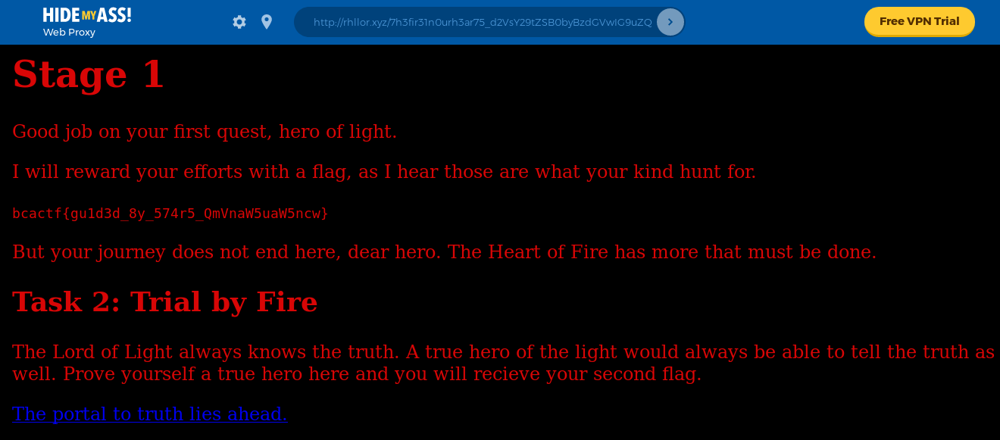

# for-the-night-is-dark-1

Hello, traveler. Welcome to your quest. You must walk the Red Lord's shining path, guided by his shining stars. Here is a picture of those stars. A map if you will. May the Lord of Light give you wisdom.

NOTE: As more heroes complete each stage of the quest, fewer points will be available to future teams.

made by: @aidanglickman

File: starmap.bmp

## Solution



If you try extracting the RGB value of the non-black pixels (Take note of the hint "One per row, top to bottom.". This means that we will start from the highest star instead of the most leftest star), 

```python
from PIL import Image

im = Image.open("starmap.bmp")
width, height = im.size
for y in range(height):
    for x in range(width):
        if im.getpixel((x,y)) != (0,0,0):
            print im.getpixel((x,y))
```



Each of the non-black pixels had different R values. If we try converting each R value to ASCII and append them altogether,

```python
from PIL import Image

im = Image.open("starmap.bmp")
output = ""
width, height = im.size
for y in range(height):
    for x in range(width):
        if im.getpixel((x,y)) != (0,0,0):
            output += chr(im.getpixel((x,y))[0])

print output
```

The output was ```http://rhllor.xyz/7h3fir31n0urh3ar75_d2VsY29tZSB0byBzdGVwIG9uZQ```, which seems to look like a URL. 



When I tried accessing the link directly, I was unable to do so for some reason. Hence I used HideMyAss's proxy to access the page.


Flag: ```bcactf{gu1d3d_8y_574r5_QmVnaW5uaW5ncw}``` 