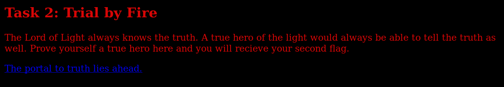
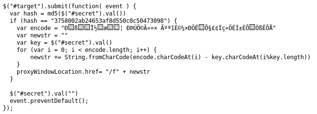

# for-the-night-is-dark-2

This task can be found through solving the prior quest tasks.

## Solution



Following from the previous challenge, we entered the portal.


I tried random values but no results were produced, so I went to look at the source.


There were 2 other Javascript files being included, so lets look through them. (Note that because I am using HideMyAss proxy, thats why those URLs are not the actual URLs)



In the second Javascript file, the value of the ```secret``` field is MD5-ed and compared to ```3758002ab24653af8d550c0c50473098``` and if it returns true, it will perform some computation and redirect us based on that.


Looking up the hash revealed that it was a MD5 hash of ```darknight```. If we enter ```darknight``` into the field,


We got redirected to the next challenge containing the flag.

Flag: ```bcactf{7h37ru7h15411w3h4v3_dGhlIGxpZ2h0IGluIG91ciBleWVz}``` 