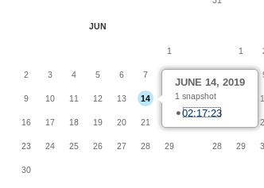
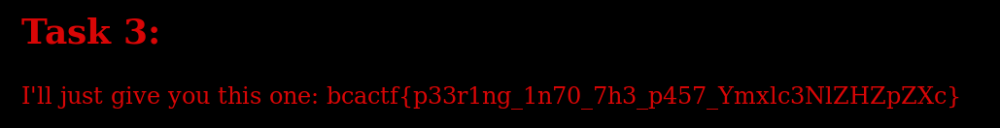

# for-the-night-is-dark-3

Keep on going

## Solution


The 2 main clues here are "was here" and "spiders who are crawling". The first thing that came to mind was Internet Archive. It is rewind time.

If we enter "http://rhllor.xyz/fl4m30fV3r1745burn5_Z2l2ZSBzdHJlbmd0aCB0byBoaXMgc3dvcmQ" into the Wayback Machine,



We find out that there was a record on 14 June. 



Flag: ```bcactf{p33r1ng_1n70_7h3_p457_Ymxlc3NlZHZpZXc} ``` 