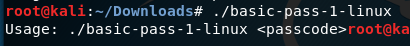
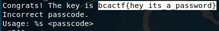

# basic-pass-1

Your company is testing out a new login software, and being one of the CompSec experts, they want you to test it. They say that they have hidden a key somewhere in the program, and want you to look for it. Find it, and they might even consider giving you a pay raise...

They have told you that there is a four digit pin on the program to unlock it.

made by: @edwfeng

File: basic-pass-1-linux

## Solution



So to get the flag, we need to guess a 4 digit number and pass it as a command line argument. Or we could just ```strings``` it...



Flag: ```bcactf{hey_its_a_password}```