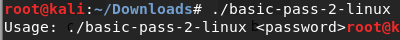
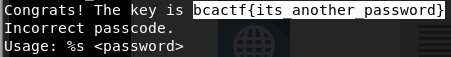

# basic-pass-2

Your company is testing out its new employee portal. After your previous shot, they made the password a bit more secure, so you can't brute force it anymore. Rise up to the occasion and demonstrate why a local machine is a bad idea, and having the account credentials on a remote server is a better idea.

made by: @edwfeng

File: basic-pass-2-linux

## Solution



Lets see if ```strings``` still work.



Flag: ```bcactf{its_another_password}```