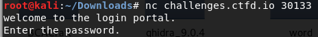

# basic-pass-3

Ok, the sysadmin finally admits that maybe authentication should happen on a server. Can you just check everything really quick to make sure there aren't any problems now? He put some readouts for people who forget their passwords.

nc challenges.ctfd.io 30133

made by: @aidanglickman

## Solution



So the password got moved to a server. After establishing a connection we get a prompt asking for the password. 


I first entered "b" and the server returned a binary string with only the first character being "1". At this point I was guessing the password is the flag.


I was right. If I enter the starting part of the flag, the first few digits got flipped to "1". So the goal of this is to make all the digits be flipped to "1" and the string submitted will be the flag. For this, I'm going to automate this using the script below:

```python
from pwn import *
import string

conn = remote("challenges.ctfd.io", 30133)

conn.recvuntil("password.\n")
conn.sendline("skip")
buff = conn.recvline().strip()

flag = ""

for idx in range(len(buff)):
    for c in string.printable:
        data = flag + c
        conn.recvuntil("password.\n")
        conn.sendline(data)
        ans = conn.recvline().strip()
        if ans == "Correct!" or ans[idx] == "1":
            flag = data
            print flag
            break
```


Flag: ```bcactf{y0u_4r3_4_m4573rm1nD!_Ym9vbGlu}```