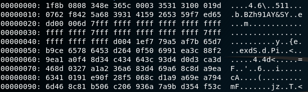

# compression

A stranger on the internet is giving away his passwords. They claim they are encrypted, but you quickly realize that it is only compressed. You have to get hold of their passwords so that you can prove them wrong.

made by: @edwfeng

File: 999

## Solution


The given file is compressed many times with various compression algorithms. I wanted to automate the decompression but instead I  reptitively run ```file``` to know the file type and ran the respective commands (```gunzip, bunzip2, tar, xxd```) to uncompress the file.



One thing to note is that for ```123``` and ```240```, they are ASCII files that contain hex dumps. To convert this format into a binary file, run ```xxd -r <filename> > output```. 

Here is the list of commands to retrieve the flag:
```bash
#!/bin/bash

mv 999 999.tar
tar -xvf 999.tar

mv 871 871.gz
gunzip -f 871.gz

mv 871 871.bz2
bunzip2 -f 871.bz2

mv 871 871.tar
tar -xvf 871.tar

xxd -r 123 > 123.gz
gunzip -f 123.gz

mv 123 123.bz2
bunzip2 -f 123.bz2

mv 123 123.gz
gunzip -f 123.gz

mv 123 123.tar
tar -xvf 123.tar

xxd -r 240 > 240.bz2
bunzip2 -f 240.bz2

mv 240 240.gz
gunzip -f 240.gz

mv 240 240.tar
tar -xvf 240.tar

mv 495 495.gz
gunzip -f 495.gz

mv 495 495.bz2
bunzip2 -f 495.bz2

mv 495 495.tar
tar -xvf 495.tar

mv 858 858.gz
gunzip -f 858.gz

mv 858 858.tar
tar -xvf 858.tar

cat 000
```

Thank goodness that number of layers won't __*that much*__. 

Flag: ```bcactf{A_l0t_0f_c0mPr3s510n}``` 