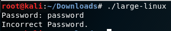
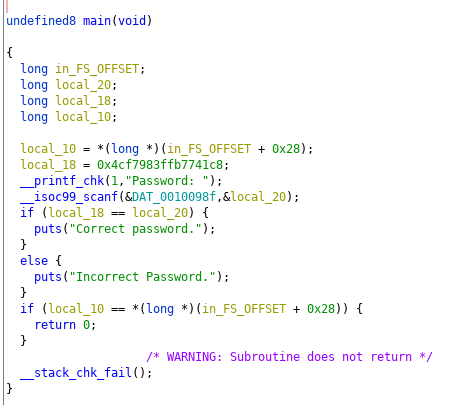
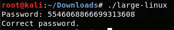

# large-pass

You've come across a USB stick in the middle of a parking lot. After taking it home, you plug it into a network-isolated, clean computer, and see a compiled program. Secrets are abound!

This problem is in a similar vein to basic-pass-2, another-pass, and so on.

The flag is not in the bcactf{...} format.

File: large-linux

## Solution



```strings``` did not reveal anything so lets try another approach using ```Ghidra```.



So to get "Correct Password" as our output, our input needs to be same as the contents of ```local_18```, which is ```0x4cf7983ffb7741c8``` or ```5546068866699313608``` in decimal.



Flag: ```5546068866699313608``` 