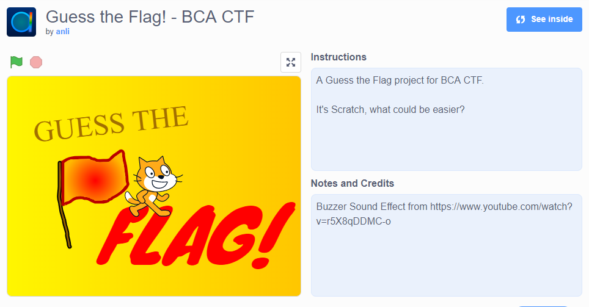

# scratch-that

I made a Guess the Flag game! It's in Scratch, what could be easier? [Click here to access the game](https://scratch.mit.edu/projects/276674047/  ).

made by: @anli5005

## Solution



This was my first time actually touching Scratch but I guess there is a first time for everything? If we click "See Inside" on the top right corner, we are able to see the source code.


From what I can see, ```define generate flag``` simply defines a function that does a series of computation and updates the global ```flag``` variable. However, according to the ```check flag``` function, if the input is wrong, the variable is resetted to "\[REDACTED\]".


Hence, what I did was remove the ```reset variables``` function call and inserted a ```show variable``` block to print the contents of the flag. If we run the game again,


Regardless of what input I gave, the game will display the ```flag``` variable out to the screen.

Flag: ```bcactf{scr4tch3d_Pourquoi_empty_23412342463682}```