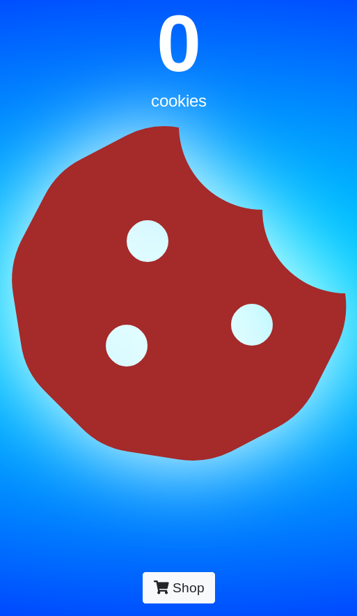
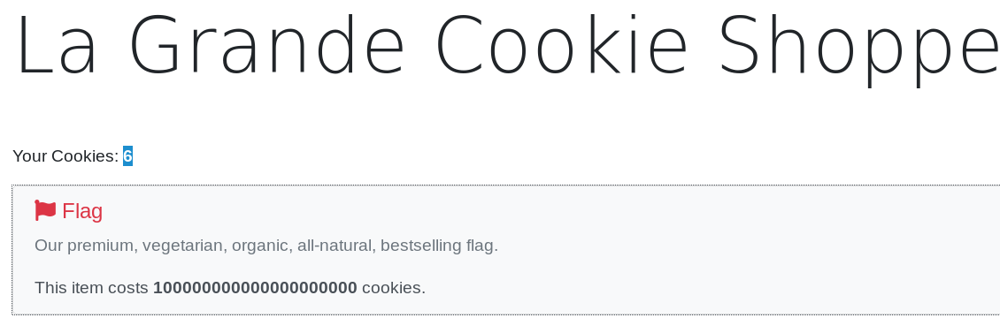
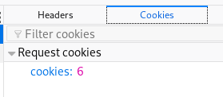
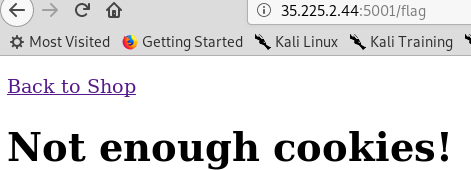

# cookie-clicker
My friend built a cookie clicker. How do I beat it?

http://35.225.2.44:5001/

Problem submitted by @anli5005

## Solution



On the bottom, we see a "Shop" button. If we click on it,



To get the flag, we need to 100000000000000000000 cookies. If we look at our current cookies,



We see that the number of cookies we have is controlled by the value of  ```cookies``` in our cookies. Hence, we just need to send a request with ```cookies``` set to 100000000000000000000.



If we click on the Flag item, we get directed to the ```/flag``` page. If we use ```curl```, we get the flag.

```
$ curl --cookie "cookies=100000000000000000000" http://35.225.2.44:5001/flag
```


Flag: ```bcaCTF{c00k13s_c71ck3d_34a2344d}```