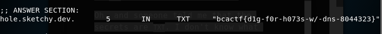

# dig-dug

I found this super sketchy website called hole.sketchy.dev. Can you help me dig up some of its secrets?

Oh, and someone told me that the secrets are TXT. I don't know what this means, so good luck!

Problem submitted by @anli5005

## Solution

Judging from the challenge's description, it wants us to use ```dig``` to query the TXT record of the given domain.

```
$ dig -t txt hole.sketchy.dev
```




Flag: ```bcactf{d1g-f0r-h073s-w/-dns-8044323}```