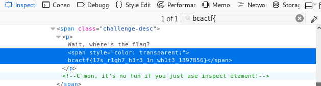

# wite-out

Wait, where's the flag?
made by: @anli5005


## Solution

Just like the-inspector, there were no URL to access so I guess the flag is probably on this page. 




Turns out the element containing the flag was set to "transparent" color.


Flag: ```bcactf{17s_r1gh7_h3r3_1n_wh1t3_1397856}```