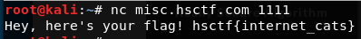

# Intro to Netcat

Written by: Ptomerty

Hey there! This challenge is a quick introduction to netcat and how to use it. Netcat is a program that will help you "talk" with many of our challenges, especially pwn and misc. To begin, Windows users should download this file:

Mirror 1 (may have DLL errors)

Alternative download that might work

Nmap download; will get flagged by school filters

Extract the file, then open a command prompt and navigate to the directory using cd <download-directory>. From there, you can run nc misc.hsctf.com 1111 to get your first flag.

File: nc.zip

## Solution

Since nc was already installed, I won't be unzipping ```nc.zip```. Lets start connecting.



Flag: ```hsctf{internet_cats}```
