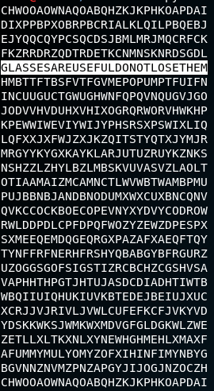

# A Lost Cause

Written by: Disha Name Credits: Shray

Pirate Keith loves cryptography and has protected his treasure with a very annoying caesar shift. He has witten “CGULKVIPFRGDOOCSJTRRVMORCQDZG” on his treasure chest and has left a piece of paper with the following message: “every subsequent letter is shifted one less than the previous.” Knowing this, can you unlock Pirate Keith’s treasure chest?

## Solution

So basically there are a total of 26 different shifts for the first letter. We can try all of them. An important thing to note is that if a letter was shift ```x``` times, you can shift it ```26 - x``` times to shift it back. Hence, instead of shifting each subsequent letter by one less than the previous, we shift by one more.

```python
enc = "CGULKVIPFRGDOOCSJTRRVMORCQDZG"

def rotate(c, shift):
    return chr((ord(c)-ord('A') + shift) % 26 + ord('A'))

for i in range(0,27):
    output = ""
    for j in range(len(enc)):
        output += rotate(enc[j], i + j)
    print output
```

Out of all the possible shifts, there was only one readable output ```GLASSESAREUSEFULDONOTLOSETHEM```




Flag: ```hsctf{GLASSESAREUSEFULDONOTLOSETHEM}```
