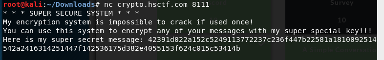
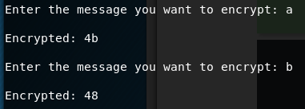
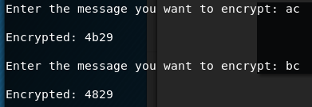
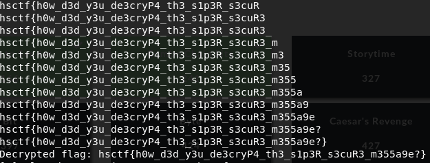

# Super Secure System

Written by: Tux

Keith made a SUPER SECURE SYSTEM!!! He claims it is so secure as long as he doesn't reuse his key...

nc crypto.hsctf.com 8111

## Solution



The super secret message is probably the encrypted version of the flag. Lets find out how it works.



At first I thought it was doing some sort of shift or rotation, but I was unable to detect any form of trend.



It seems that each position is independent of each other, meaning that each positon has their own list of character mappings. We can probably brute force this.

```python
from pwn import *
import string

conn = remote("crypto.hsctf.com", 8111)

conn.recvuntil("Here is my super secret message: ")

enc = conn.recvline().strip()

print "Encrypted flag: " + enc

flag = ""

for idx in range(0, len(enc), 2):
    for char in string.printable:
        conn.recvuntil("Enter the message you want to encrypt: ")
        conn.send("A"*(idx/2) + char)
        conn.recvuntil("Encrypted: ")
        output = conn.recvline().strip()[-2:]
        if enc[idx:idx+2] == output:
            flag += char
            print flag
            break

print "Decrypted flag: " + flag
```




Flag: ```hsctf{h0w_d3d_y3u_de3cryP4_th3_s1p3R_s3cuR3_m355a9e?}```
