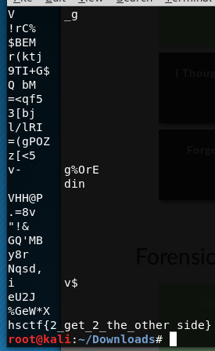

# Chicken Crossing

Written by: Jeremy Hui

Keith is watching chickens cross a road in his grandfather’s farm. He once heard from his grandfather that there was something significant about this behavior, but he can’t figure out why. Help Keith discover what the chickens are doing from this seemingly simple behavior.

## Solution


Nothing out of place here, let's ```strings``` it.



In the last line we see the flag.

Flag: ```hsctf{2_get_2_the_other_side}```
