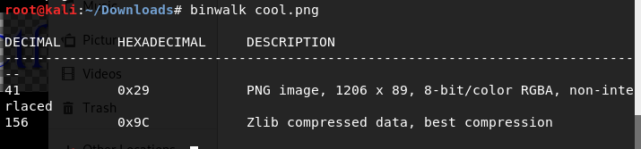
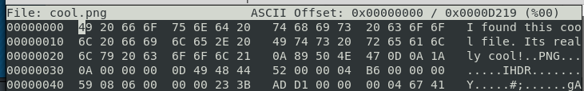

# Cool Image 2

Written by: cppio

My friend sent me this image, but I can't open it. Can you help me open the image?

File: cool.png

## Solution

We are unable to open the file. But why ? Lets run ```file``` to find out.


Hmm...Data ? Lets run ```binwalk``` to find any hidden files.



It does contain a .png file. Let's run ```foremost``` to extract it and open the .png file.


Turns out if you run ```hexeditor``` on it, you will see there is a message before the PNG file header. No wonder ```file``` did not detect it as a .png file.




Flag: ```hsctf{sorry_about_the_extra_bytes}```
