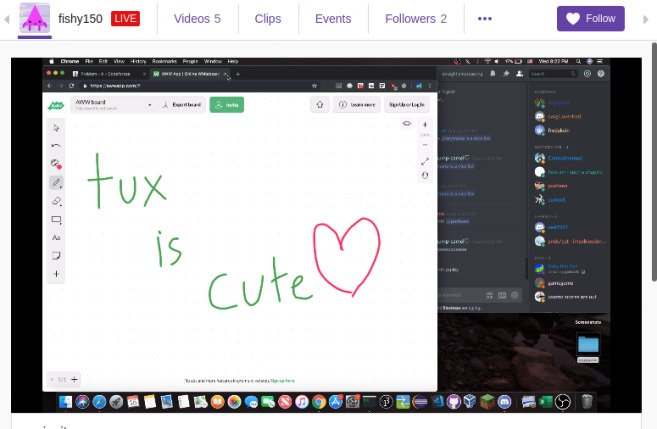
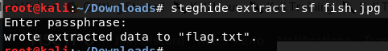
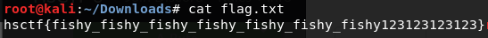

# Fish

Written by: Tux

I got a weird image from some fish. What is this?

File: fish.jpg

## Solution



Hm... That's a lot of white. However, running ```stegsolve``` did not return any results. Lets ```strings``` it.


We see a string ```bobross63```. Maybe this is some form of password? Lets use ```steghide``` along with the password.



It worked! Lets check ```flag.txt```



Flag: ```hsctf{fishy_fishy_fishy_fishy_fishy_fishy_fishy123123123123}```
