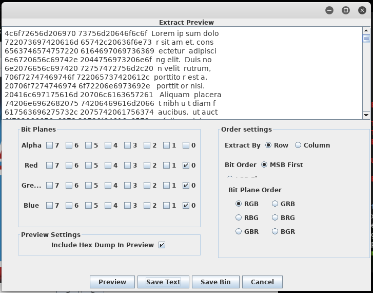
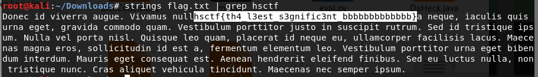

# Logo Sucks Bad

Written by: Tux

This logo sucks bad.

## Solution


Nothing weird here. If we look at the first letter of each word in the name of the challenge, we get "LSB". You guessed it, this is a Least Significant Bit challenge. Let's use ```stegsolve``` for this.



Navigate to ```Analyse -> Data Extract```. Select bit 0 of Red, Green and Blue and click on ```Preview```. You will see that we managed to fetch out some readable content. The flag is probably here. Click on ```Save Bin``` to extract it to a file.




Flag: ```hsctf{th4_l3est_s3gnific3nt_bbbbbbbbbbbbb}```
