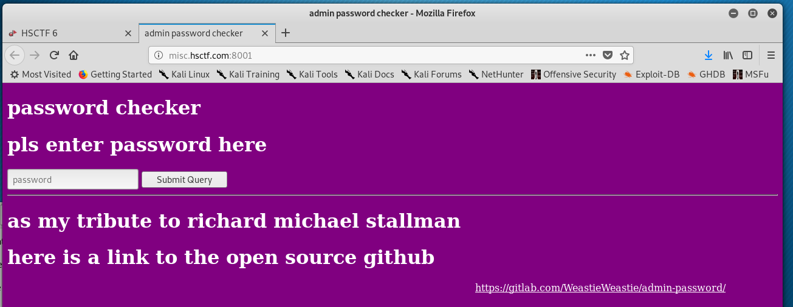
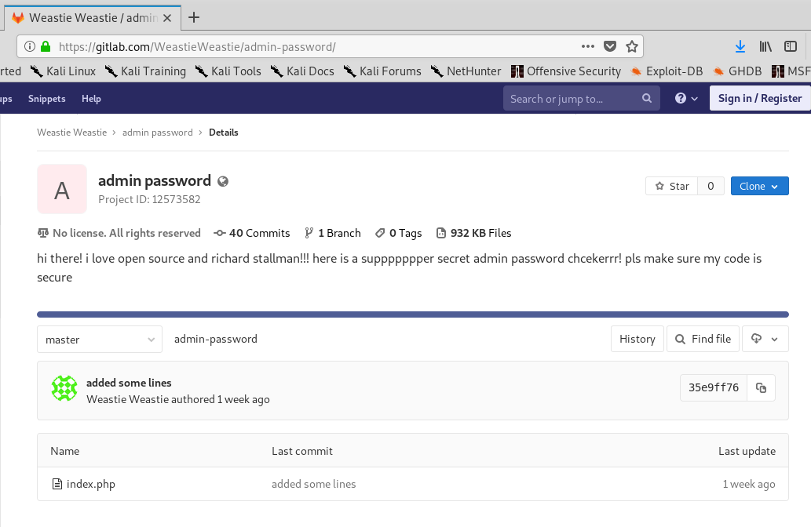
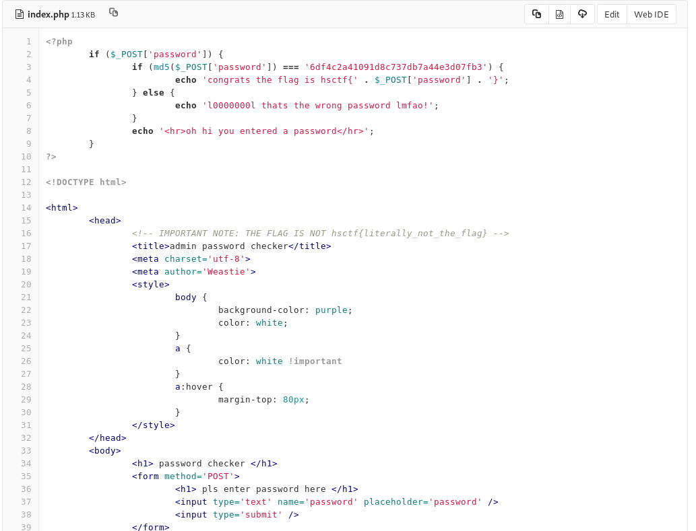
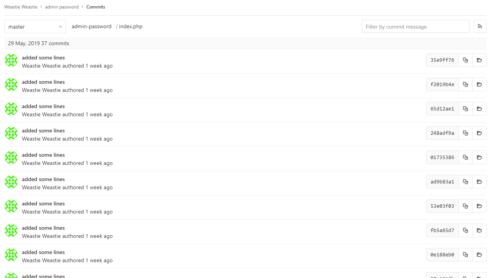
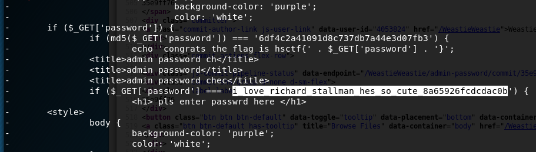

# Admin Pass

Written by: Weastie

Hey guys, found a super cool website at http://misc.hsctf.com:8001!


## Solution



I guess we need to search for a password, but where? If you look below, there is a link to someone's [repo](https://gitlab.com/WeastieWeastie/admin-password/)



This repo contains the code for this challenge and ```index.php``` might contain the password.



Hmm... no password here. But we do know that the password is MD5 hashed and compared to a certain hash ```6df4c2a41091d8c737db7a44e3d07fb3```. I tried using online hash databases to look it up but there were no matches. Lets see the commit history and hope that we are able to find something.



Wow there are a lot of commits to go through. I made a script to dump out all deletions from each commit since the password could have been deleted before the current commit.

```python
import requests
import re

web = "https://gitlab.com"
repo = "/WeastieWeastie/admin-password"

resp = requests.get(web + repo + "/commits/master")

commits = set(re.findall(repo + "/commit/([a-z0-9]+)", resp.content))

for commit in commits:
	diff = requests.get(web + repo + "/commit/" + commit + ".diff").content
	for line in diff.split("\n"):
		if line.startswith('-') and not line.startswith("---"):
			print line
```



Bingo, we got the password. We submitted this to the form and got the flag.

Flag: ```hsctf{i_love_richard_stallman_hes_so_cute_8a65926fcdcdac0b}```
