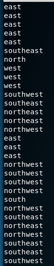

# Real Reversal

Written by: Disha and Shray

Ella is following a broken GPS. The GPS tells her to move in the opposite direction than the one she should be travelling in to get to her destination, and she follows her GPS exactly. For instance, every time she is supposed to move west, the GPS tells her to move east and she does so. Eventually she ends up in a totally different place than her intended location. What is the shortest distance between these two points? Assume that she moves one unit every time a direction is specified. For instance, if the GPS tells her to move "north," she moves one unit north. If the GPS tells her to move "northwest," then she moves one unit north and one unit west.

Input Format:
You will receive a text file with N directions provided to her by the GPS (the ones that she will be following) (1<=N<=1000). The first line in the file will be N, and each consequent line will contain a single direction: “north,” “south,” “east,” “west,” “northwest,” “northeast,” “southwest,” or “southeast.”

Output Format:
Round your answer to the nearest whole number and then divide by 26. Discard the quotient (mod 26). Each possible remainder corresponds to a letter in the alphabet. (0=a, 1=b… 25=z).

Find the letter for each test case and string them together. The result is the flag. (For instance, a, b, c becomes “abc”). Remember to use the flag format and keep all letters lowercase!

File: input.zip

## Solution

Ahh I love this kind of programming questions. If we unzip ```input.zip```, we get 12 different files, from ```1.txt``` to ```12.txt```, each containing lines of directions.



According to the question, for each file there are, we need to keep track of 2 locations, one where Ellia went the correct direction and one where Ellia followed the GPS and going the opposite direction. I used the following script to answer this.

```python
import os

output = ""

# Mapping direction to (x,y) changes
directions = {
    "south": (0, -1),
    "north": (0, 1),
    "west": (-1, 0),
    "east": (1, 0),
    "southeast": (1, -1),
    "southwest": (-1, -1),
    "northeast": (1, 1),
    "northwest": (-1, 1)
}

# Return updated coordinates if moved the correct direction
def correct_move(coor, direction):
	coor[0] += directions[direction][0]
    	coor[1] += directions[direction][1]
	return coor

# Return updated coordinates if follow GPS
def wrong_move(coor, direction):
	coor[0] -= directions[direction][0]
	coor[1] -= directions[direction][1]
	return coor

# Return distance between 2 coordinates using Pythogoras' theorem
def dist(coor1, coor2):
	return ((coor1[0]-coor2[0])**2 + (coor1[1]-coor2[1])**2)**0.5


for idx in range(1,13):
    filename = str(idx) + ".txt"
    correct = [0, 0]
    gps = [0, 0]
    with open(os.path.join("input", filename), "r") as f:
        lines = f.readlines()
        for line in lines[1:]:
            direction = line.strip()
	    correct = correct_move(correct, direction)
            gps = wrong_move(gps, direction)
    
    flag = int(round(dist(correct, gps)))%26
    output += chr(flag + ord('a'))

print output
```

We got ```garminesuckz```.

Flag: ```hsctf{garminesuckz}```


