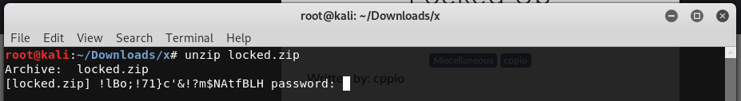
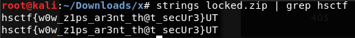

# Locked Up

Written by: cppio

My friend gave me a zip file with the flag in it, but the zip file is encrypted. Can you help me open the zip file?

File: locked.zip

## Solution



When unzipping, we are prompted for a password. Sadly, we know none. Lets run ```strings``` if we can find password or maybe a flag.



That was unexpected. We managed to get the password without even unzipping!

Flag: ```hsctf{w0w_z1ps_ar3nt_th@t_secUr3}```
