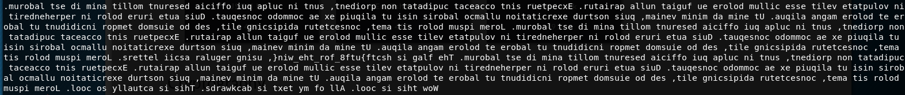
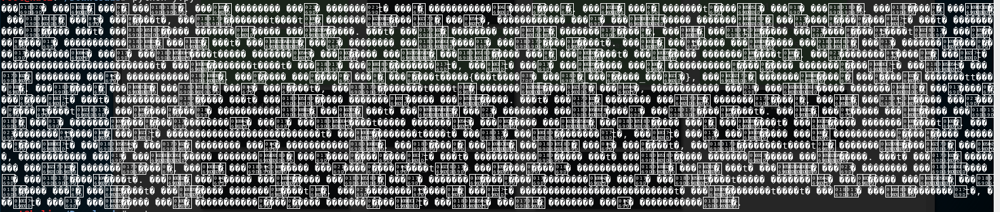
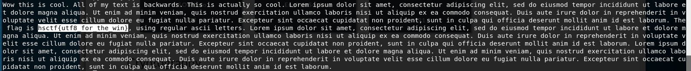

# Real Reversal

Written by: cppio

My friend gave me some fancy text, but it was reversed, and so I tried to reverse it but I think I messed it up further. Can you find out what the text says?

File: reversed.txt

## Solution

When we run ```strings``` on it, we got gibberish stuffs. Let's try reversing it

```python
with open("reversed.txt" , "rb") as f:
    print f.read()[::-1]
```



We are starting to see something but it seems each of the words are also reversed. Lets improve the script once more.

```python
with open("reversed.txt" , "rb") as f:
    words = f.read().strip()[::-1].split()
    for word in words[::-1]:
	    print word[::-1],
```



What is going on ? I am only simply reversing each word but for some reason, I am getting gibberish instead. If we try to view the hex of the last word "woW", we get this

```['\xf0', '\x9d', '\x9a', '\xa0', '\xf0', '\x9d', '\x9a', '\x98', '\xf0', '\x9d', '\x9a', '\x86']```

Hmm... 4 bytes to represent each character. Could this be in UTF-8 format ?

```python
with open("reversed.txt" , "rb") as f:
    words = f.read().strip()[::-1].split()
    for word in words[::-1]:
	    print word.decode("utf-8")[::-1],
```



I guessed I learnt something new from this. I actually manually typed it in reverse during the CTF.


Flag: ```hsctf{utf8_for_the_win}```
