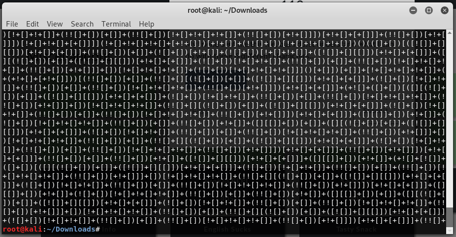
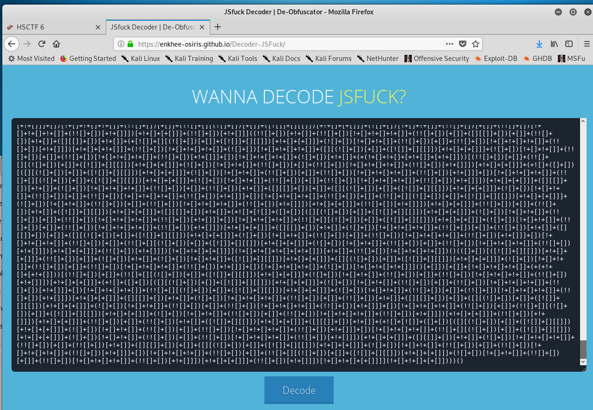

# Verbose

Written by: dwang

My friend sent me this file, but I don't understand what I can do with these 6 different characters...

File: verbose.txt

## Solution



Hm... This seems like an esoteric language. After some searching, I found out that ```JSFuck``` was used to construct this. I managed to find a [website](https://enkhee-osiris.github.io/Decoder-JSFuck/) to decode this code.



When decoded, we get this:
```
var flag = "hsctf{esoteric_javascript_is_very_verbose}"; window.location = "https://hsctf.com";
```

Flag: ```hsctf{esoteric_javascript_is_very_verbose}```
