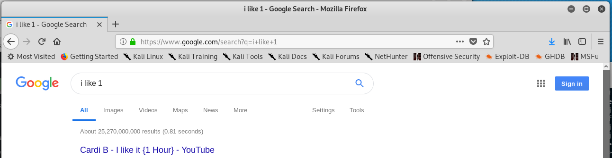
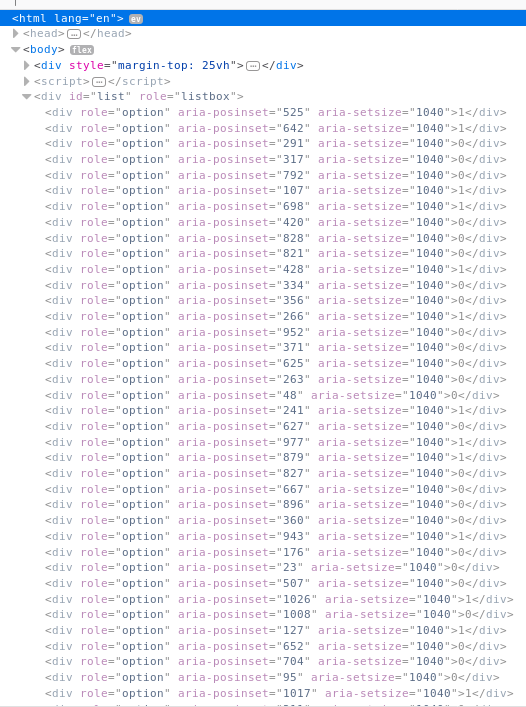

# Accessible Rich Internet Applications

Written by: NotDeGhost

A very considerate fellow, Rob believes that accessibility is very important!

NOTE: The flag for this challenge starts with flag{ instead of hsctf{

File: index.html

## Solution


The contents of the file was full of javascript code and no flag, so I opened it with a browser and was presented with the actual page. 



I entered something random and hit "enter" and was brought to Google with the search ```i like 1```. What is going on? Instead of viewing the source, I inspected the page. 



Interesting, there is a list of ```<div>s``` with different ```aria-posinset``` values and have 1s and 0s as the content. I think I got the gist of this. This list needed to be sorted according to ```aria-posinset``` and we save the content of each ```<div>``` in that order to a binary string, which is then converted to ASCII to get the flag.

```python
#!/usr/bin/python

import re
import binascii

result = ["0"]*1040

with open("x","r") as f:
    lx = [line.strip() for line in f.readlines()]

    for line in lx:
        digit = re.findall(">(\d)<", line)[0]
        idx= int(re.findall("aria-posinset=\"(\d+)\"", line)[0])

        result[idx] = digit

print binascii.unhexlify("%x" % int("".join(result),2))
```

```
im gonna add some filler text here so the page is a bit longer. lorem ipsum... here's the flag btw, flag{accessibility_is_crucial}
```

Flag: ```flag{accessibility_is_crucial}```