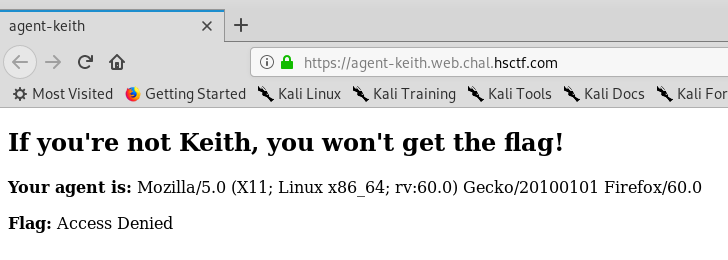

# Agent Keith

Written by: dwang

Keith was looking at some old browsers and made a site to hold his flag.

https://agent-keith.web.chal.hsctf.com

## Solution



I guess to get the flag, we will need to modify our user-agent. But to what ? Lets check the source


We see a comment saying: ```DEBUG (remove me!!): NCSA_Mosaic/2.0 (Windows 3.1)```. I guess this is the user-agent that we are looking for. I am going to use ```curl``` for this one.


Using the ```--user-agent```, we are able to manually set the user agent that ```curl``` will use when sending HTTP requests. In the HTML result, we see the flag.

Flag: ```hsctf{wow_you_are_agent_keith_now}```