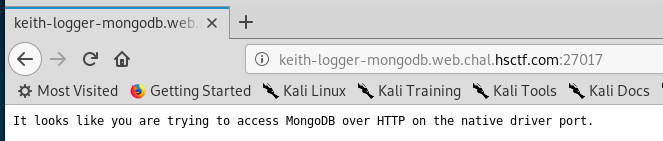
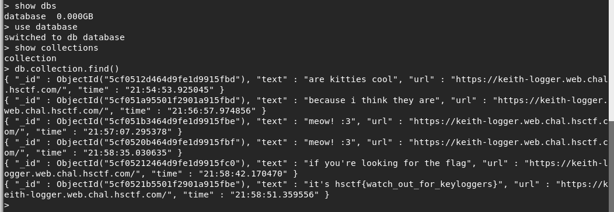

# Keith Logger

Written by: dwang

Keith is up to some evil stuff! Can you figure out what he's doing and find the flag?

Note: nothing is actually saved

File: extension.crx

## Solution

A .crx file? I never seen such an extension before. Lets run ```file``` to know what exactly is it.


A Google Chrome extension? As I was lazy to install Chrome on my VM, I'm going to do this using another way. If I run ```strings``` on it, I get random gibberish, but I noticed 3 file names.


I understand that this was not a forensics question, but I am still going to run ```foremost``` on this. The output was a single ZIP file. If we unzipped it, we get the mentioned files. The ```jquery``` file and the ```manifest.json``` wasn't important but ```content.js``` is. 


We noticed that there are 2 HTTP endpoints here: ```https://keith-logger.web.chal.hsctf.com/api/record?text=``` and ```https://keith-logger.web.chal.hsctf.com/api/admin```. I am going to skip straight to the second one.


We see a username, a password and an endpoint related to MongoDB? I have never really used MongoDB but let's check out the link.



So there is indeed MongoDB service but I can't access it via HTTP ? After some research, it seems I need a MongoDB client called ```mongo``` to access it. Since Kali doesn't have it, I had to install it: ```apt-get install mongodb-org-shell```. Now, I can run ```mongo```.


Nice, we got in. 



There was only one database and one collection in that database. By running ```db.collection.find()```, we can list the contents of the collection. In the last record, we see the flag.

Flag: ```hsctf{watch_out_for_keyloggers}```