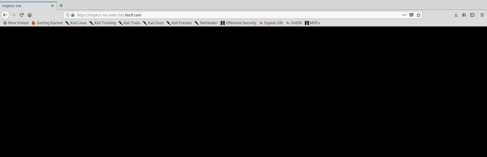
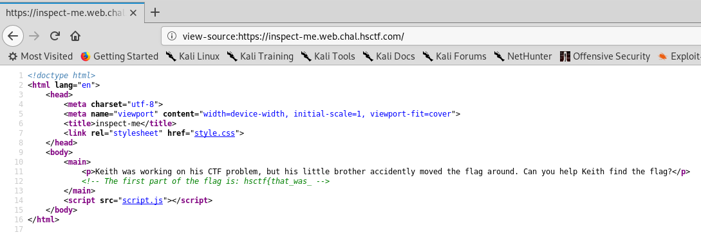
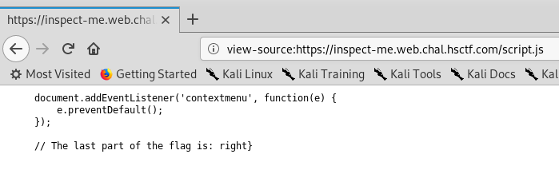

# Inspect Me

Written by: dwang

Keith's little brother messed up some things...

https://inspect-me.web.chal.hsctf.com

Note: There are 3 parts to the flag!

## Solution



All black ? Hmm time to check the source. I was unable to right-click on the page, so I decided to do it manually by entering ```view-source:https://inspect-me.web.chal.hsctf.com``` into the browser to get the page source.



Nice, we got the first part of the flag: ```hsctf{that_was_``` 
We also see there are 2 additional files: ```style.css``` and ```script.js```. They probably each contain a part of the flag too.


The second part of the flag is ```pretty_easy_```.



And last but not least, the third and last part of the flag is ```right}```.

Flag: ```hsctf{that_was_pretty_easy_right}```