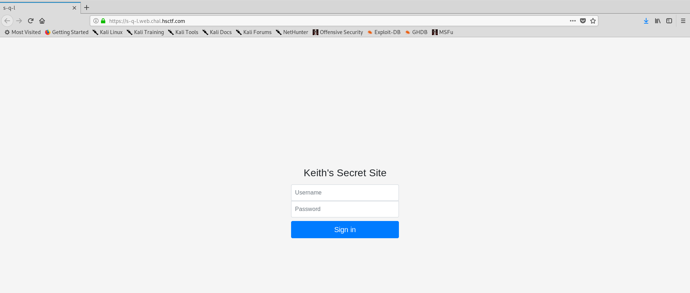
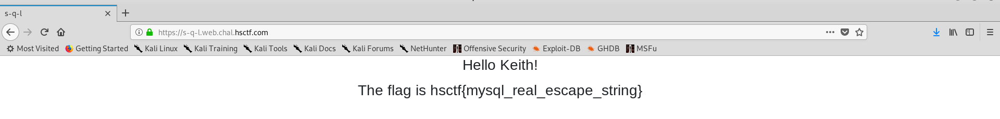

# S-Q-L

Written by: dwang

Keith keeps trying to keep his flag safe. This time, he used a database and some PHP.

https://s-q-l.web.chal.hsctf.com/

## Solution



Hmm a login page? And the question is called "SQL"? It is basically screaming SQL injection. I entered ```'--``` into the username field and ```'``` into the password field.



Boom, we got the flag.


Flag: ```hsctf{mysql_real_escape_string}```