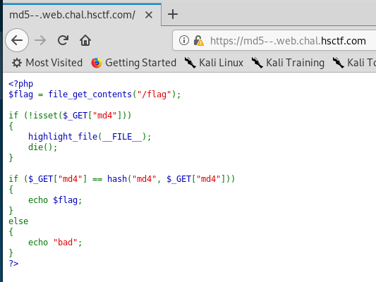
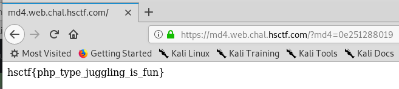

# md5--

Written by: dwang

md5-- == md4

https://md5--.web.chal.hsctf.com

Note: If the link above doesn't work, try https://md4.web.chal.hsctf.com

## Solution



Ooo PHP source code. So we need to send a GET request with a ```md4``` field. However, the value to submitted has to be an MD4 hash of itself? Is that even possible? This was not a cryptography question, so it has to be something relating to PHP itself. After some research, I came across a writeup that is closely related to this. Turns out it has something to do with ```==``` in PHP, where if both sides look like a decimal value, a hexadecimal value or a floating point value, it will attempt to cast both to numbers before comparing.

```php
var_dump("0e123" == "0e456");// Returns bool(true)
```

Hence, we need to find a string which start with "0e" and will produce a MD4 hash which also starts with "0e".

By modifying the script found in the writeup,
```python
#!/usr/bin/env python
import hashlib
import re

prefix = '0e'

def breakit():
    iters = 0
    while 1:
        s = prefix + str(iters)
        hashed_s = hashlib.new('md4',s).hexdigest()
        iters = iters + 1
        r = re.match('^0e[0-9]{30}', hashed_s)
        if r:
            print "[+] found! md4( {} ) ---> {}".format(s, hashed_s)
            print "[+] in {} iterations".format(iters)
            exit(0)

        if iters % 1000000 == 0:
            print "[+] current value: {}       {} iterations, continue...".format(s, iters)


breakit()
```

After running this, we got this value: ```0e251288019```. 



By appending ```?md4=0e251288019``` to the URL, we get the flag.

Flag: ```hsctf{php_type_juggling_is_fun}```

## Reference
https://github.com/bl4de/ctf/blob/fd3ea48b33e60c4c8682c36c46d2bf89b254d0ff/2017/HackDatKiwi_CTF_2017/md5games1/md5games1.md